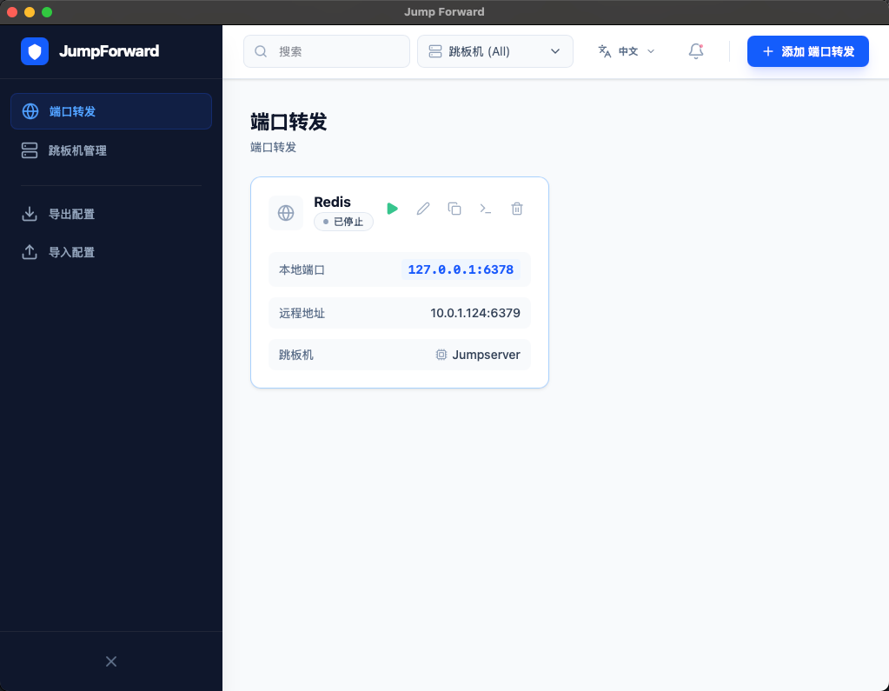

# Jump Forward 🚀

[简体中文](./README_CN.md) | English

[](https://wails.io)
[](https://golang.org)
[](https://reactjs.org)

Jump Forward is a modern, cross-platform SSH port forwarding manager built with **Go** and **Wails v3**. It simplifies managing complex SSH tunnels and bastion host (Jump Host) connections with a clean, intuitive interface.



## ✨ Features

- **🛡️ Secure Tunneling**: Manage multiple SSH port forwarding rules effortlessly.
- **🏗️ Jump Host Support**: Built-in support for bastion hosts with both **Password** and **SSH Key** authentication.
- **🔄 Smart Updates**: Automatic version checking via GitHub Releases with in-app notifications.
- **📊 Real-time Monitoring**:
  - Live connection status (Running, Stopped, Error).
  - **Active connection tracking** showing client IP and connection time directly on each card.
  - Interactive terminal-like log viewer for each forwarding rule.
- **🌐 Internationalization (i18n)**:
  - Full support for **Chinese (Default)** and **English**.
  - One-click language switching without restarting.
- **🔍 Advanced Filtering**:
  - Instant search by rule name or remote host.
  - **Multi-select Jump Host filtering** to organize rules by server.
- **📦 Configuration Management**:
  - Secure **Export/Import** of configurations with password encryption.
  - Automatic persistence of all settings.
- **🍎 macOS Optimized**:
  - Native **Single-instance** restriction.
  - Automated **DMG packaging** with a professional blue shield icon.
- **🔔 Notification System**: Real-time Toast notifications for connection events and system alerts.

## 🚀 Getting Started

### Prerequisites

- [Go](https://golang.org/dl/) 1.21+
- [Node.js](https://nodejs.org/) 18+
- [Wails v3 CLI](https://v3.wails.io/getting-started/installation/)

### Installation & Build

1. **Install Wails v3 CLI**:
   ```bash
   go install github.com/wailsapp/wails/v3/cmd/wails3@latest
   ```

2. **Clone and Install Dependencies**:
   ```bash
   git clone https://github.com/your-repo/jump-forward.git
   cd jump-forward/frontend
   npm install
   ```

3. **Development Mode**:
   ```bash
   # From the root directory
   wails3 dev
   ```

4. **Production Build (macOS DMG)**:
   ```bash
   wails3 task package:dmg
   ```
   The output will be in `bin/jump-forward.dmg`.

## 🛠️ Built With

- **Backend**: [Go](https://golang.org/), [Wails v3](https://wails.io/)
- **Frontend**: [React](https://react.dev/), [TypeScript](https://www.typescriptlang.org/), [Tailwind CSS](https://tailwindcss.com/)
- **Icons**: [Lucide React](https://lucide.dev/)
- **State Management**: [i18next](https://www.i18next.com/), [Sonner](https://sonner.emilkowal.ski/)

## 📄 License

This project is licensed under the MIT License - see the [LICENSE](LICENSE) file for details.
